# All-In-One Smart Home Sensor Case V2

## Please read the disclaimer at the bottom before printing

Hello everyone 👋, this has been one of my biggest projects so far. If you have any questions about the project please ask them in the comments then I can answer them and everyone can learn from that.

When I started building my smart home, I realized that most devices only cover very specific use cases. To get full functionality in each room, you usually need to buy multiple different devices.

My goal with this project was to create **the ultimate DIY smart home sensor device** that integrates all the essential sensors needed to achieve the following:

## 🎯 Goals

1. Control the lighting in a room by turning it on when motion is detected and keeping it on as long as someone is present (even if the person is not moving).
1. Monitor the brightness in the room and only turn lights on if needed (and off again when no longer required).
1. Measure air quality, humidity, and temperature.
1. Use Bluetooth to track a person’s smartphone and thereby determine which room they are in, so the smart home can react accordingly.
1. Keep the footprint as small as possible.
1. Powered by a single cable. USB-C in particular.
1. Ensure the design is unobtrusive and blends seamlessly into the living room.
1. Integrate with Home Assistant.
1. No cloud dependency.

## 🆕 Changes since the V1 Version

1. 3 different versions for different boards
    - Version for the ESP32 D1 Mini (no need to desolder the pins anymore 🥳).
    - Version for the ESP32 Super Mini (it should work with ESP32 C3/C6/S3, but i only tested it with the C6)
    - Version for the ESP32 Large Version
1. No need for jumper headers and wires / everything is soldered so it is a more secure connection
1. Separated wifi antenna and motion sensor farther apart to reduce false positive detections
1. Incorporate the ball head mount into the design, which is fully printable now and does not need a screw anymore.
1. The brightness sensor shield is now a solid part of the body. To print it you need an AMS or you have to remove that part before printing.
1. Tweaked the software
    - easier calibration experience
    - use of esp-idf framework which results in way less memory usage, so more features can be activated
    - added captive portal out of the box
    - german and english variant
    - used other uart pins, because using the uart0 will hinder from flashing the device via usb

## 🔢 Steps

1. Source all the parts from the shopping list
1. Print the enclosure
1. Solder all sensors to the esp
1. Flash the ESP with the software and verify that all sensors work (connect it to your Home Assistant instance to monitor them).
1. Assemble the sensors and ESP into the enclosure.
1. Place the device in its designated spot.
1. After a few minutes, calibrate the sensors and re-flash the software.
1. Create your Home Assistant automations using the sensors.

### 🛒 Shopping List

You can also buy the parts from other sites. If you don’t mind waiting, AliExpress is usually cheaper. I’ve listed the exact products I used because I can confirm they worked for me.

| Name | Hint | Link |
| ----- | ------ | ------ |
| ESP32 | This case features several variants that fit different ESP form factors.   I would recommend the D1 Mini or Super Mini Variants | D1 Mini [Amazon](https://www.amazon.de/dp/B0FP2N2YNL)   D1 Mini [AliExpress](https://de.aliexpress.com/item/1005006414001036.html?spm=a2g0o.order_list.order_list_main.27.2d3b5c5fHxAbjl&gatewayAdapt=glo2deu)   ESP32 Large [Amazon](https://www.amazon.de/dp/B0D9BSKR16?ref_=ppx_hzsearch_conn_dt_b_fed_asin_title_2&th=1)   ESP32 C6 Super Mini [Aliexpress](https://de.aliexpress.com/item/1005009089500839.html?spm=a2g0o.order_list.order_list_main.11.1ab05c5f8xuanX&gatewayAdapt=glo2deu) (you need to choose the correct version manually) |
| Power Supply (PSU) | Any low-power PSU you already have should work. Otherwise, buy a simple one. | [Amazon](https://www.amazon.de/dp/B0D7MD5BJ3?ref=ppx_yo2ov_dt_b_fed_asin_title&th=1) |
| Temperatur Sensor BME280 or BME680 | BME680 air quality readings may not be reliable (see Disclaimer). | [BME280](https://www.amazon.de/dp/B0CYH34X3P?ref=ppx_yo2ov_dt_b_fed_asin_title)   [BME680](https://www.amazon.de/dp/B0CYH34X3P?ref=ppx_yo2ov_dt_b_fed_asin_title) |
| Screws | <ul><li>BME280/BME680 = 1x M2.5x3mm</li><li>Presence Sensor Shield = 3x M2x3mm</li><li>Motion Sensor HC-SR501 = 2x M2x3mm</li><li>Brightness Sensor BH170 = 2x M2x3mm</li></ul> You can try to use M2 for all the sensors but the BME280 sensor cutouts are too big for M2 head and might fall through. | [Amazon](https://www.amazon.de/dp/B0CZNT5YXV?ref=ppx_yo2ov_dt_b_fed_asin_title&th=1)|
| Brightness Sensor BH1750 | Works flawlessly for me, no hints necessary. | [Amazon](https://www.amazon.de/dp/B0D3WN41FS?ref=ppx_yo2ov_dt_b_fed_asin_title)|
| Motion Sensor HC-SR501 | The sensor case is specifically designed for a motion sensor with this form factor. I know they are not the best, but they are reasonably cheap, see Disclaimer for more details | [Amazon](https://www.amazon.de/dp/B0939XMBXJ?ref=ppx_yo2ov_dt_b_fed_asin_title) |
| Presence Sensor LD2410B | <ul><li>The sensor case is specifically designed for a presence sensor with this form factor. I experienced that they are not the best, but they are reasonably cheap, see Disclaimer for more details. </li><li>The soldering points of this sensor are smaller than the ones of the other sensor and the esp. It is very hard to remove the pins. I would advise to buy the variant without the pins. </li><li>It might be possible to use jumper wires here so you don't have to solder, but the pins are smaller than the standard jumper wire ones and need the appropriate smaller jumper wires. </li><li>An alternative is to solder the wires directly to the pin headers, although this might be janky, it works and is way less hassle.</li></ul> | [Aliexpress](https://de.aliexpress.com/item/1005004920357733.html?spm=a2g0o.order_list.order_list_main.232.23775c5f0Fhk0S&gatewayAdapt=glo2deu) |
| Cables | I used 22 AWG wire | [Aliexpress](https://de.aliexpress.com/item/1005007671008743.html?spm=a2g0o.order_list.order_list_main.227.23775c5f0Fhk0S&gatewayAdapt=glo2deu) |
| Long USB Cable | Choose length to fit your setup. | [Aliexpress](https://de.aliexpress.com/item/1005007053181899.html?spm=a2g0o.order_list.order_list_main.262.23775c5fsHIXLm&gatewayAdapt=glo2deu) |
| Filament | I printed my case in Kingroon White PLA and with Kingroon White PETG. You can use bambu labs filament of course. I printed the brightness sensor cover out of translucent PLA/PETG. | [Kingroon White PLA](https://de.aliexpress.com/item/1005007226921275.html?spm=a2g0o.order_list.order_list_main.29.51fa5c5fMbjQzg&gatewayAdapt=glo2deu)   [Elegoo Transparent PLA](https://www.amazon.de/dp/B0CD7BS7B1?ref_=ppx_hzsearch_conn_dt_b_fed_asin_title_8) |
| Cable Distribution (Proto Boards) | I broke something off proto boards that I got lying around and used that to distribute the cables which needed to go to multiple sensors. I added a link to something similar. You can try a different approach. Don't try to solder every cable from every sensor directly to the ESP as this will be a mess 😅 | [Aliexpress](https://de.aliexpress.com/item/1005006236993083.html?spm=a2g0o.productlist.main.53.59ba6ef0R2AfKV&algo_pvid=fdf3a000-9cfe-46b8-8db1-369f4ad17722&algo_exp_id=fdf3a000-9cfe-46b8-8db1-369f4ad17722-52&pdp_ext_f=%7B%22order%22%3A%22124%22%2C%22eval%22%3A%221%22%7D&pdp_npi=6%40dis%21EUR%212.59%212.59%21%21%212.95%212.95%21%402103868817563684986428248ea8fb%2112000036410088438%21sea%21DE%216147561042%21X%211%210%21n_tag%3A-29919%3Bd%3A856b28b5%3Bm03_new_user%3A-29895&curPageLogUid=e0I1agpXpJrw&utparam-url=scene%3Asearch%7Cquery_from%3A%7Cx_object_id%3A1005006236993083%7C_p_origin_prod%3A) |

You also need:

- A soldering iron (and soldering skills)
- Solder
- Wire stripping tool
- Side cutters to trim the cables
- Screwdriver
- Pliers
- Desoldering pump (optional)
- Multimeter (optional if you trust your soldering skills)

### 🖨️ Print Instructions

- **Material:** PLA/PETG
- **Layer Height:** 0.20 mm
- **Nozzle:** 0.4 mm
- **Infill:** 15 %
- **Walls:** 2
- **Divider:** print **upright** with a **brim**, flat side on the build plate. If you orient it differently, it won’t print correctly.
- **Brightness sensor shield:** print with **transparent** material, or omit it entirely. It’s not required but hides the sensor a bit and improves the look.

### 🔢 Assembly Instructions

1. If you are using the ESP32 Large version you need to desolder the pins
1. **Desolder Motion sensor (HC-SR501) pins:**
    - Remove the pin spacers with pliers.
    - Clamp the motion sensor in a vise.
    - Desolder and remove the pins. It’s also possible to heat the solder and pull the pins with pliers without a desoldering pump.
1. Break a **2×3** matrix from the proto board — for **motion** and **presence** sensors.
1. Break a **4×3** matrix from the proto board — for **brightness** and **temperature** sensors.
1. Cut wires to length. I wrote the length of the cables in mm into the connection drawings. I show the two distribution boards separately to make things easier to follow. (There are further steps below on soldering order.) Pick the Connection Drawing that matches the ESP32 Version that you are using. The cable lengths and pinout slightly differs depending on the version.
    - I only got 5 colors of cables
        - red = Voltage (If you have more colors use different colors for 3.3V (BME/BH1750) and 5V(LD2410/HC-SR501), It is important to never mix them up)
        - black = Ground
        - Green = I2C SCL/UART (If you have more colors you can use different colors for UART and I2C)
        - Blue = I2C SDA/UART (If you have more colors you can use different colors for UART and I2C)
        - Yellow = Motion Out

   #### D1 Mini

    Temperature and Brightness sensors

    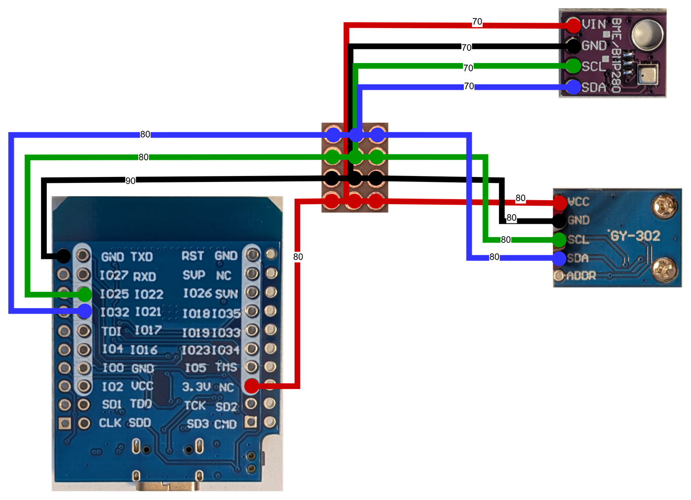

    Presence and Motion Sensors

    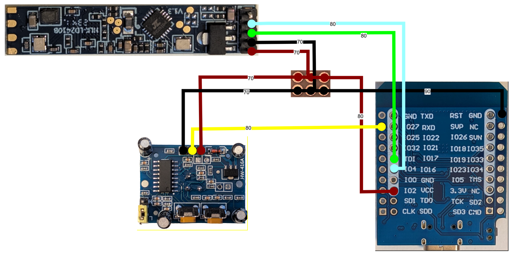

   #### ESP32 Large

    Temperature and Brightness sensors
    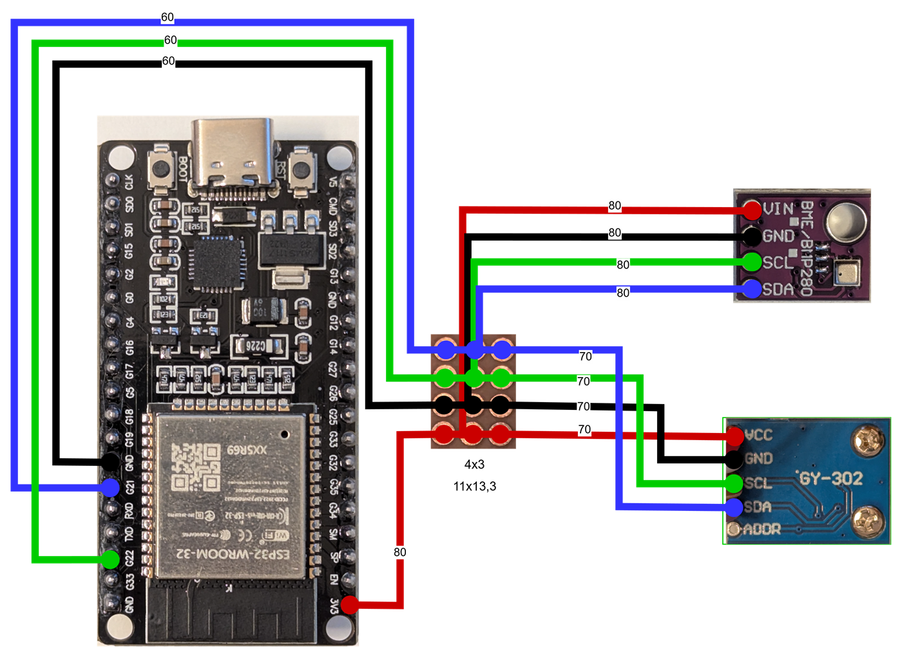

    Presence and Motion Sensors
    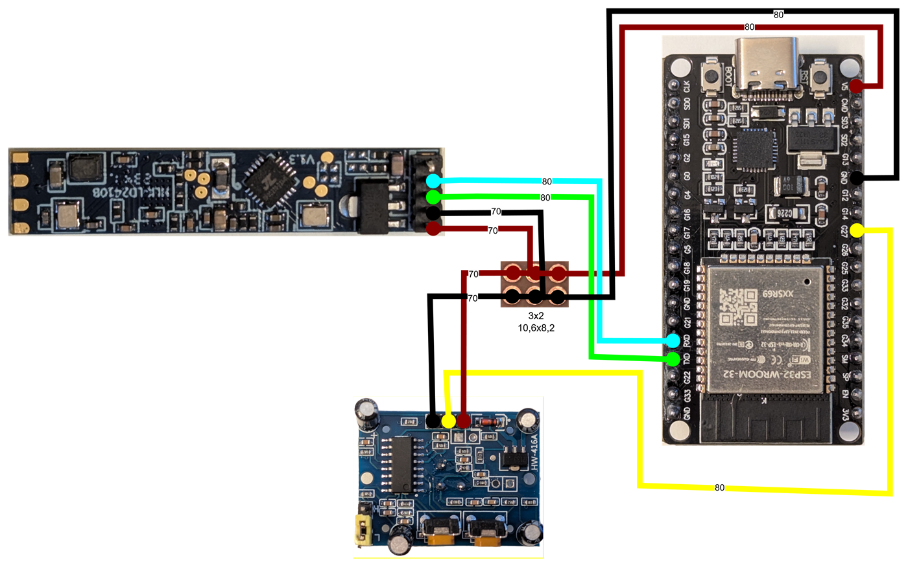

   #### Super Mini

    the Ground of the two distribution boards are connected as the board only has one ground pin
    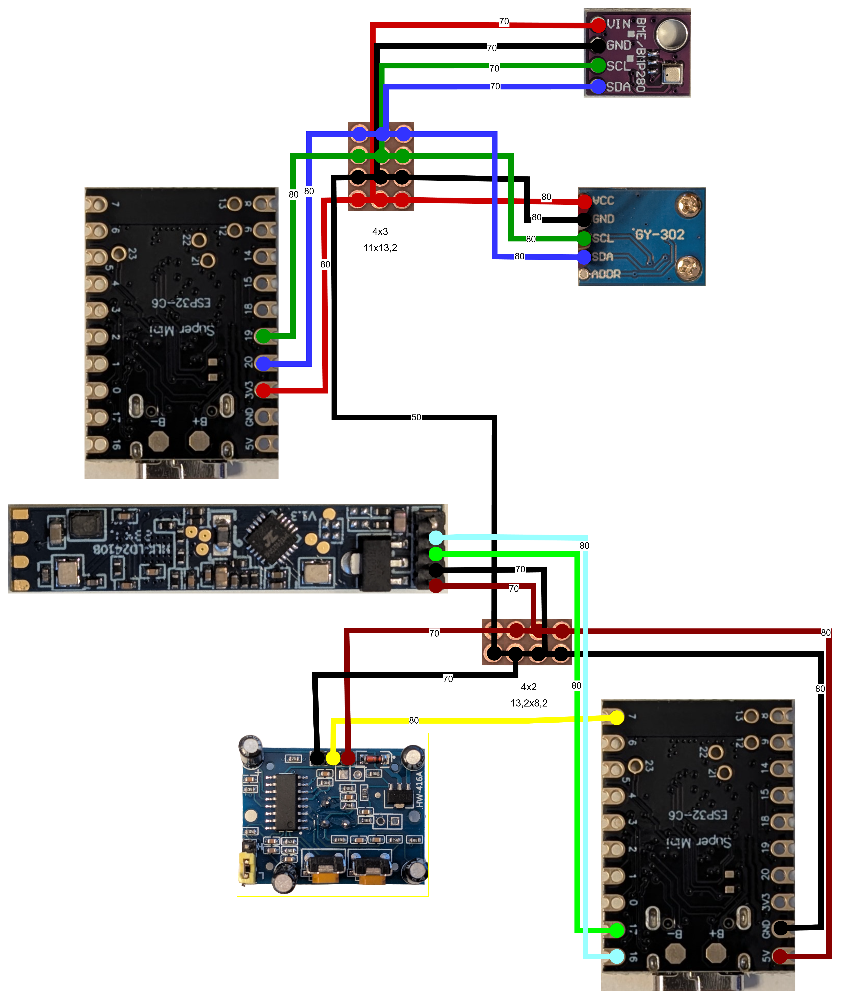

1. Make sure to tin the wire ends
1. Solder **one end** of each wire to the **sensors** as described in the Connection Drawings from Step 4

    | Motion Sensor | Presence Sensor | Brightness Sensor | Temperature Sensor |
    | ---- | ---- | ---- | ---- |
    | 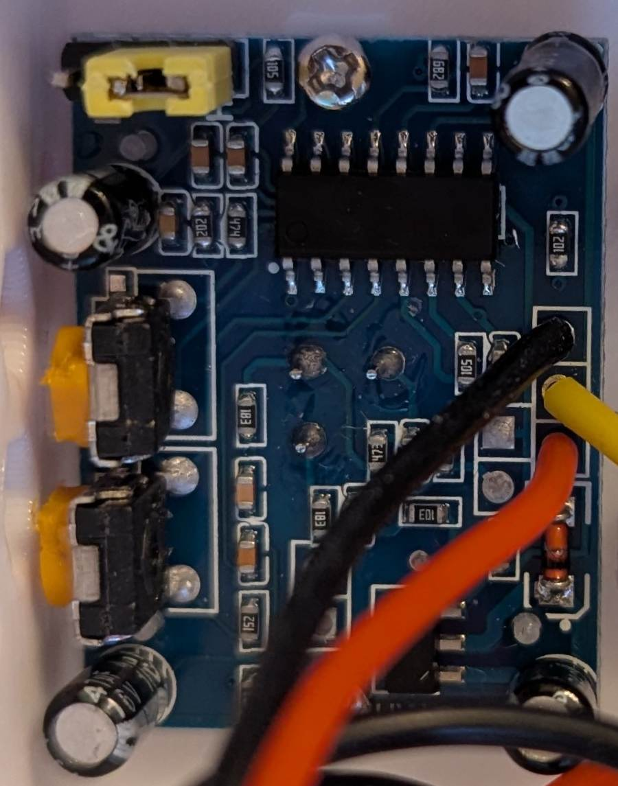 |  | 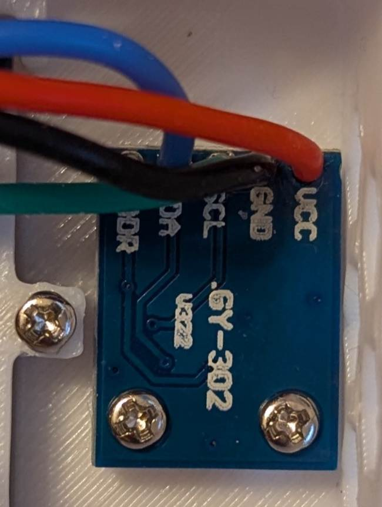 |  |

1. Solder the **other end** of the wires to the **distribution proto boards and ESP respectively. Connect wires of the same color together**. If you used a proto board where the lines are already connected via the board you don't need to do any extra step. My proto board has separated solder points so I had to bridge them.

    - The 4x3 pin distribution board is connected to the brightness and temperature sensors.
    - The 2x3 pin distribution board is connected to the motion and presence sensors.

    |4x3|2x3|
    |---|---|
    |  | 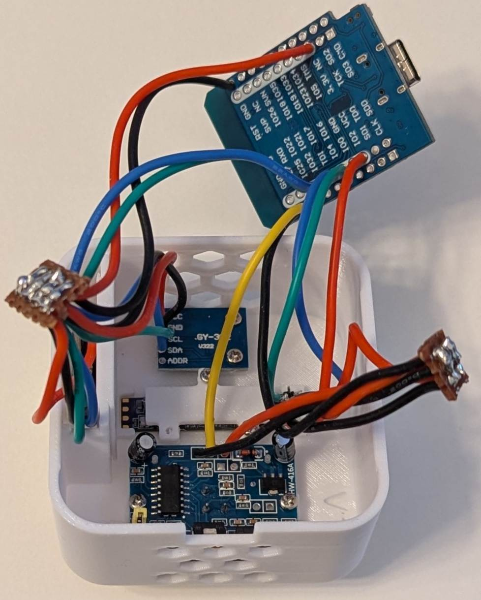 |

1. **Solder the wires to the ESP pins** as described in the connection drawings above. You need to attach the cables from the back side (because the wifi antenna is on the front and we want that to be facing away from the motion sensor) — attach them as shown in the photos.

    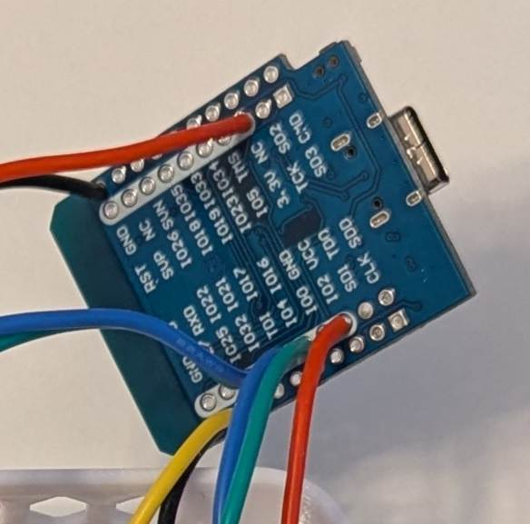

1. Use a **multimeter** to verify that solder joints of different colors do not bridge. Any short can damage components and may cause smoke or even fire.
1. Now it's time to check whether all the soldering has worked out. Flash the software onto the ESP. It can be found in the software section. Verify that all sensors are detected and reporting, then return here to complete assembly.
1. Screw all the sensors in place using M2x3mm screws

    

1. Screw the temperature sensor in place. For the BME680 There is already a cone protruding from the wall that holds the sensor in place on the lower screw hole. (1x M2.5x3mm)

    

1. Slide the **divider wall** into place. It shields the temperature sensor from ESP board heat. It won’t eliminate the effect entirely, but it’s an improvement.

    

1. Attach the **ball head** to the back of the enclosure.

    

1. Slide the ESP32 into the rails on the backplate. And attach the USB cable.

    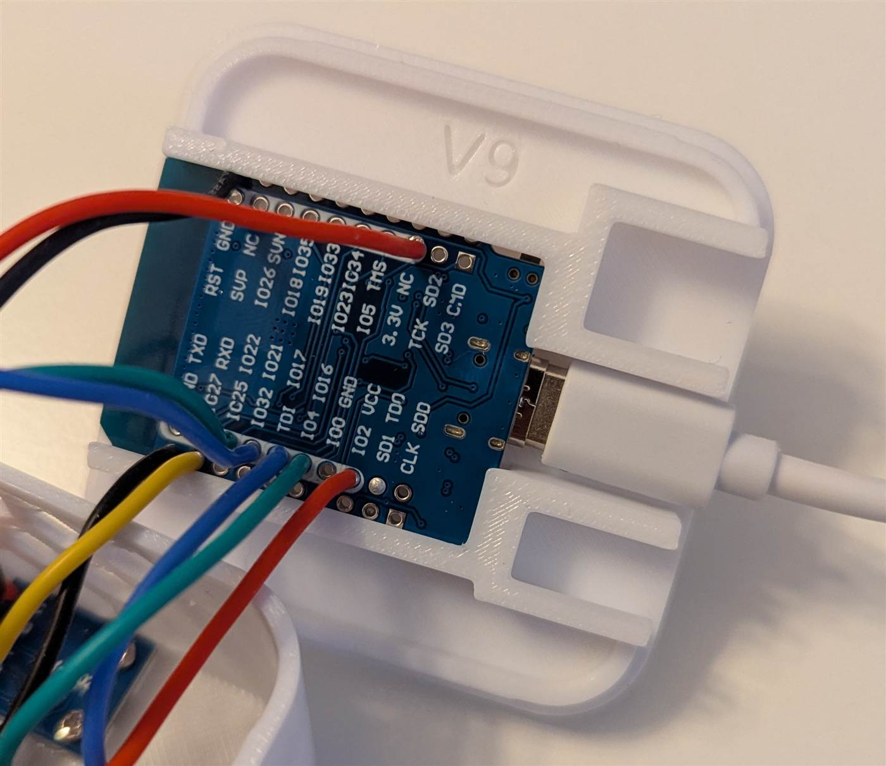
    

1. Slide the distribution boards into the rails on the backplate.

    

1. Close the lid — it **snaps** into place.

    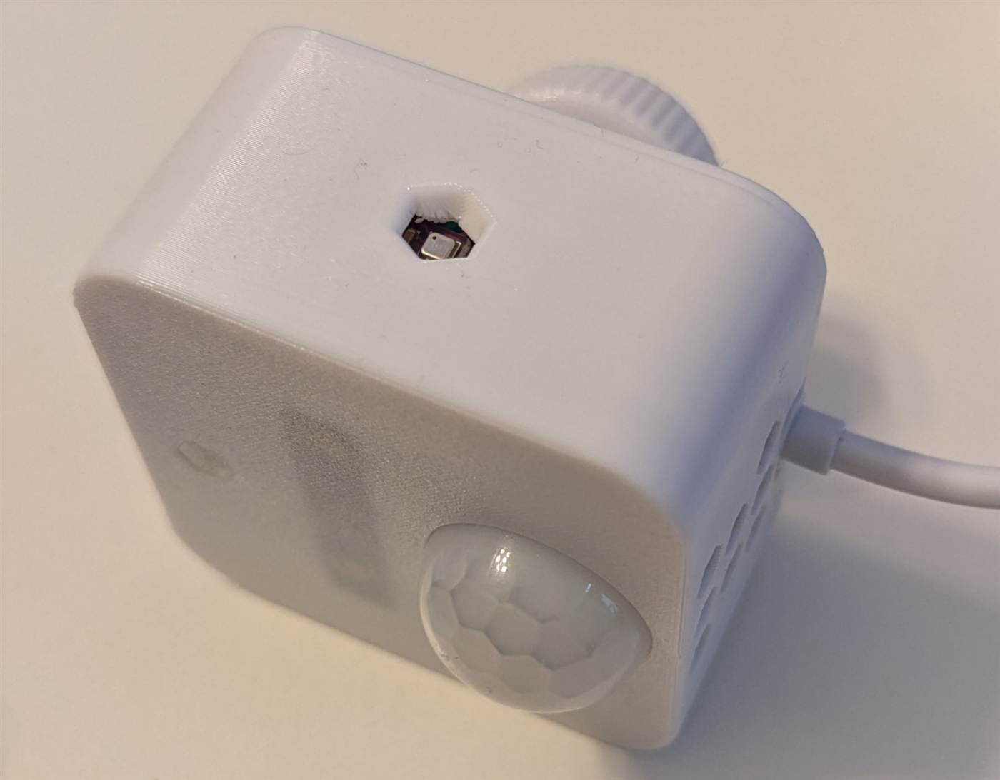

**Congratulations — you’re done!** 🥳🎉

Post a picture and a comment to this model — I’d love to see your results 🤗

### 💾 Software

This project uses [ESPHome](https://esphome.io/) as the underlying software. It’s easy to set up and flash. You need a single YAML file that defines the sensors connected to the device and their properties. I won’t provide general ESPHome flashing instructions — the official documentation is excellent:
Guide: <https://esphome.io/guides/installing_esphome/>

1. Download the source code from [my GitHub](https://github.com/DerGary/all-in-one-sensor-device/archive/refs/heads/main.zip)
1. Extract the zip file
1. Navigate to the V2 Folder
1. There is an esp32.yaml (for the D1 Mini and the ESP32 Large Version) and an esp32supermini.yaml (for the supermini version, with another pinout). Choose the one that matches your ESP version. You can copy the file multiple times and name it differently if you want to create multiple devices.
1. Change the **friendly name, name**, and optionally the **area** to your liking.
1. Also uncomment/comment out the includes for the language package and the sensor that you are using.
1. In **secrets.yaml**, set **wifi-password** and **wifi-ssid** to your Wi-Fi credentials.
1. Set the **esp-password** and **esp-username** to any values you like. If you create multiple devices you should set unique values for each of the device and rename the secrets to reflect that.
1. Set the **esp-api-key** to a value generated via the website: <https://esphome.io/components/api/#configuration-variables> This value is used to add the device to home assistant. If you create multiple devices you should set unique values for each of the device and rename the secrets to reflect that.
1. Run ``esphome run device.yaml`` to flash the device.
1. Test whether all sensors work as expected.
1. Once deployed in its final location, proceed with calibration.

### 🎯 Calibration

Calibration is **non-trivial** and may take time and multiple iterations. I mainly use **offset calibration**, which is the easiest approach, though there are more accurate methods also available.

#### BME680

I only calibrated **temperature** and **humidity**. I don’t use air pressure, and air quality is meant to auto-calibrate.

1. Let the device sit in its final location for **5–10 minutes** to saturate with heat from the ESP.
1. Place a **trusted temperature & humidity sensor** nearby.
1. In the **parameters** section of your ESPHome file, set ``bme680_temperature_offset`` to the difference between your device and the trusted sensor. Flash the new values — this also changes humidity readings.
1. Additionally you can calibrate humidity and temperature further using the input components **Temperature Offset** and **Humidity Offset** directly in Home Assistant.

#### BME280

Again, I only calibrated temperature and humidity; I don’t use air pressure.

1. Let the device sit for **5–10 minutes** to heat-soak.
1. Place a trusted sensor nearby.
1. Calibrate humidity and temperature using the input components **Temperature Offset** and **Humidity Offset** directly in Home Assistant.

#### Motion Sensor

The motion sensor has a jumper that defines the mode of the sensor.

- H (Repeat Trigger / Retriggerable mode)
  - As long as motion is detected, the output stays **HIGH**.
Example: If the delay time is set to 10 s and motion is detected again after 5 s, the timer resets and the output remains HIGH continuously until no more motion is detected.
- L (Single Trigger / Non-Retriggerable mode)
  - When motion is detected, the output goes **HIGH** for the set delay time, then returns to LOW — even if motion is still happening during that period. Only after the delay finishes and the sensor is ready again can it trigger once more.

The default seems to be **L**, while I use **H**.

The sensor has **two potentiometers**: one for **trigger time** and one for **sensitivity**. Looking from the back, the **left** is sensitivity and the **right** is time delay (I always mix them up 😅).

1. Set the **time delay** long enough that the presence sensor has already triggered, but short enough to release in a timely manner when a person leaves. This makes automations easier.
1. Set **sensitivity** just high enough to trigger where needed, but as low as possible to reduce false positives.
I set it to about there:

    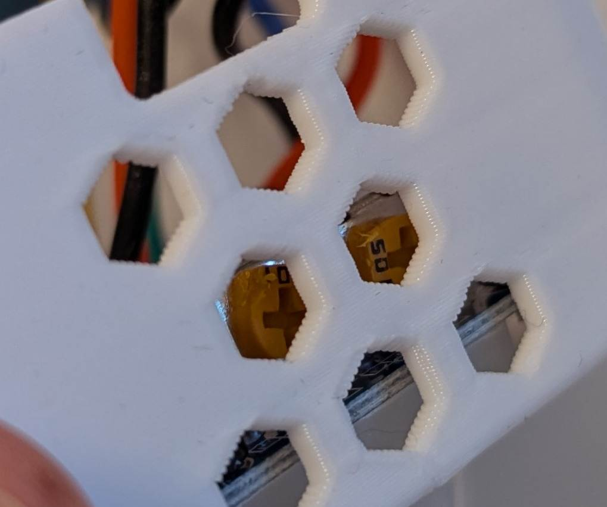

Presence Sensor:

This sensor is the most challenging to calibrate. The g0-g8 values depict the different distances from the sensor.

1. **Enable Engineering Mode**
1. Ensure **no one is in the room** while calibrating.
1. Let the sensor sit for **10 minutes** while Home Assistant gathers **g0–g8 move/still** energy values.
1. Review the history of each **g0–g8** value in Home Assistant. Find the **highest** value each.
1. Set the **g0–g8 thresholds** to **5–10 % higher** than the highest observed value for this distance.
1. **Disable engineering mode**

### 🚫 Don'ts

1. Don’t mount the device **too high**. Hot air rises and will skew and destabilize temperature readings; it may also affect the motion sensor.
1. Don’t place the device **near a heater** — it reduces temperature accuracy and can trigger the motion sensor.
1. Don’t place it directly in strong airflow (e.g., when airing the room), as the motion sensor detects rapid heat changes.

### 📢 Tips

- You can use the [underware collection](https://makerworld.com/de/models/783010-underware-2-0-infinite-cable-management?from=search#profileId-1504508) to route your cables.
- You can use [**my cable clamps**](https://makerworld.com/de/models/1744421-adhesive-cable-clamp-for-usb-cables-4mm-3mm#profileId-1853998) to route USB cables. They fit the cables linked here, use minimal filament, and can be attached with double-sided tape.
- You can use [my collection of ball head mounts](https://makerworld.com/de/collections/9129741-ball-head-mounts) to mount the device to cabinets, tubes, walls, desks etc.
- It’s preferable to position the device **facing the area where you stay** rather than just facing the door. The motion sensor has a wide field of view and covers most of the room, while the presence sensor works best when pointed directly at the target.
- You can test all sensors with **jumper wires** before committing to soldering.

### ⚠️ Disclaimer

This project is **not easy**: you have to solder a lot, including **very small** pins. You have been warned — but I’d love to see people try it 😊

The finished product is not perfect — that’s why the title is not *“Ultimate Smart Home Sensor Device”* 😅. I plan to release a revised version with other sensors when I have time and when the sensors I want become more accessible. Since I don’t know when that will be, I’m sharing this version for now.

**Things that bug me on the current version:**

1. **(This got a lot better on the V2 version, to a point where its not really an issue anymore, but it might happen and therefore is still listed here)** The motion sensor is very cheap and sometimes triggers when no one is in the room. (This can be minimized by **reducing the ESP’s Wi-Fi signal strength**, as cheap motion sensors are prone to misfire due to Wi-Fi interference.)
1. The motion sensor can trigger when you **air the room**, as it detects heat changes.
1. The presence sensor uses **24 GHz**. While it can detect mostly stationary humans, it cannot detect **very small movements** or someone under a blanket. (This mostly applies to my girlfriend — somehow I am tracked a bit better 😅).
1. The presence sensor is **extremely hard to solder**. I actually broke a sensor by accidentally desoldering the resistor right next to the pins. I now solder the wires directly to the pins which is janky but it works and is a lot easier.
